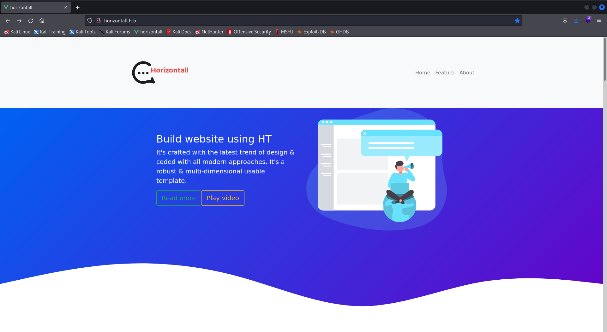

# Walkthrough HTB --> Horizontall


We use nmap to scan the target machine with the command:

```bash
──(root💀animale)-[/home/animale]
└─# nmap -sV -sC 10.10.11.105
Starting Nmap 7.92 ( https://nmap.org ) at 2022-01-18 06:14 IST
Nmap scan report for horizontall.htb (10.10.11.105)
Host is up (0.095s latency).
Not shown: 998 closed tcp ports (reset)
PORT   STATE SERVICE VERSION
22/tcp open  ssh     OpenSSH 7.6p1 Ubuntu 4ubuntu0.5 (Ubuntu Linux; protocol 2.0)
| ssh-hostkey: 
|   2048 ee:77:41:43:d4:82:bd:3e:6e:6e:50:cd:ff:6b:0d:d5 (RSA)
|   256 3a:d5:89:d5:da:95:59:d9:df:01:68:37:ca:d5:10:b0 (ECDSA)
|_  256 4a:00:04:b4:9d:29:e7:af:37:16:1b:4f:80:2d:98:94 (ED25519)
80/tcp open  http    nginx 1.14.0 (Ubuntu)
|_http-title: horizontall
|_http-server-header: nginx/1.14.0 (Ubuntu)
Service Info: OS: Linux; CPE: cpe:/o:linux:linux_kernel

Service detection performed. Please report any incorrect results at https://nmap.org/submit/ .
Nmap done: 1 IP address (1 host up) scanned in 13.39 seconds
```

We can see that port 80 and 22 are open.

I then added the ip to my **/etc/hosts** with the following command:

```bash
echo "10.10.11.105 horizontall.htb" >> /etc/hosts

```

As usual we run **gobuster** to scan our target website.

In the meantime, let's have a look into the web page:




The result doesn't show anything interesting.

```bash
┌──(root💀animale)-[/home/animale]
└─# gobuster dir -u http://horizontall.htb/  -w /usr/share/dirbuster/wordlists/directory-list-2.3-medium.txt -t 100                                                                                                                       1 ⨯
===============================================================
Gobuster v3.1.0
by OJ Reeves (@TheColonial) & Christian Mehlmauer (@firefart)
===============================================================
[+] Url:                     http://horizontall.htb/
[+] Method:                  GET
[+] Threads:                 100
[+] Wordlist:                /usr/share/dirbuster/wordlists/directory-list-2.3-medium.txt
[+] Negative Status codes:   404
[+] User Agent:              gobuster/3.1.0
[+] Timeout:                 10s
===============================================================
2022/01/18 06:15:33 Starting gobuster in directory enumeration mode
===============================================================
/img                  (Status: 301) [Size: 194] [--> http://horizontall.htb/img/]
/css                  (Status: 301) [Size: 194] [--> http://horizontall.htb/css/]
/js                   (Status: 301) [Size: 194] [--> http://horizontall.htb/js/] 
Progress: 6964 / 220561 (3.16%)                                                 ^C
[!] Keyboard interrupt detected, terminating.
                                                                                 
===============================================================
2022/01/18 06:15:40 Finished
===============================================================

```

